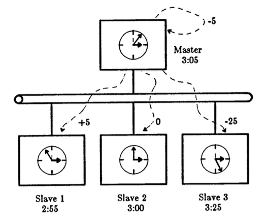

# Berkeley Algorithm



This is an implementation of the Berkeley Algorithm in the C programming language, with the aim to distribute correctly among the clients an internal timestamp defined by a server.
Raw TCP connections using sockets are used for our implementation.

## Components

### Slaves

Every slave sends its actual timestamp to the master and may receive a response with an adjustment to apply to its clock.

### Master

The master calculates the average of all the timestamps that it has received, including its own clock, and sends to each client the difference between the calculated average and the sent timestamp (the adjustment), if it's more than a prefixed delta-T.

## Packet structure

### Server Polling

- packet_type = 0x00
- window_id = 32 bit uint little endian

```
+-------------+-----------+
| packet_type | window_id |
+-------------+-----------+
```

### Client Polling Response

- packet_type = 0x01
- window_id = 32 bit uint little endian
- clock = 64 bit little endian

```
+-------------+-----------+-------+
| packet_type | window_id | clock |
+-------------+-----------+-------+
```

### Server Sync Clock

- packet_type = 0x69
- window_id = 32 bit uint little endian
- s = 0x00 or 0x01
- adjustment = 32 bit uint little endian

```
+-------------+-----------+---+------------+
| packet_type | window_id | s | adjustment |
+-------------+-----------+---+------------+
```

## Future additional features

[x] RTT calculation: the Round Trip Time can be taken into account for the average of the timestamps
[x] UDP protocol: use UDP to reduce the overhead
[x] Master election: Fault Tolerance
